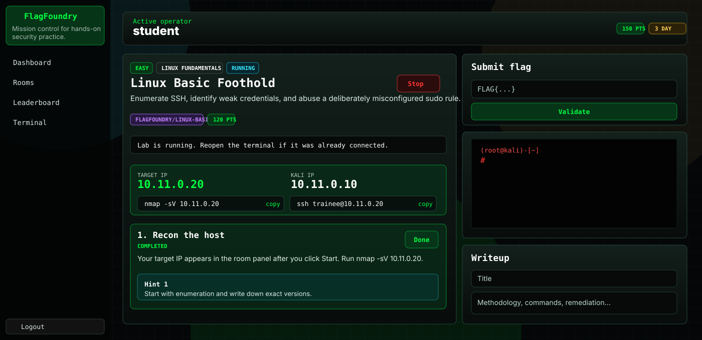

# FlagFoundry Cybersecurity Training Platform


A local cyber-range cybersecurity training platform with Docker-backed rooms, isolated lab networks, a browser Kali terminal, JWT auth, flags, hints, learning paths, writeups, and admin room management.

This project intentionally runs vulnerable containers. Keep it local. Do not expose the backend, Docker socket, lab networks, or target containers to the public internet.

## Preview



## Prerequisites

Install these using their official docs. This README only covers the project-specific setup.

| Tool | Needed for | Official link |
| --- | --- | --- |
| Docker Desktop | App containers, Postgres, Kali, vulnerable labs | https://docs.docker.com/desktop/setup/install/windows-install/ |
| Node.js LTS | Prisma, seed scripts, local package scripts | https://nodejs.org/en/download |
| Git for Windows | Cloning/version control | https://git-scm.com/install/windows |
| OpenVPN Connect | Optional future VPN flow | https://openvpn.net/client/ |

Before continuing, these should work in PowerShell:

```powershell
node --version
npm --version
docker version
docker compose version
```

## Project Layout

```text
platform/
  frontend/              React + Tailwind UI
  backend/               Express API, Docker orchestration, WebSocket terminal
  db/                    Prisma schema and seed data
  docker/kali/           Kali attacker image
  docker/vulnerable/     Room target images
  vpn/                   OpenVPN profile scaffold
  docker-compose.yml
```

## First Run

Run these from PowerShell:

```powershell
cd D:\
copy .env.example .env
npm install
npm run prisma:generate
docker compose up --build
```

Keep that terminal open. In a second PowerShell window:

```powershell
cd D:
npm run prisma:migrate
npm run seed
.\docker\build-labs.ps1
```

When Prisma asks for the first migration name, use:

```text
initial_schema
```

Open:

```text
http://localhost:5173
```

## Accounts

| Role | Email | Password |
| --- | --- | --- |
| Student | `student@flagfoundry.local` | `StudentPass123!` |
| Admin | `admin@flagfoundry.local` | `AdminPass123!` |

## Normal Development Loop

Start the stack:

```powershell
docker compose up
```

Start it in the background:

```powershell
docker compose up -d
```

Stop app containers:

```powershell
docker compose down
```

Rebuild after frontend/backend code changes:

```powershell
docker compose down
docker compose up --build
```

Reseed after room/task/flag seed changes:

```powershell
npm run seed
```

Rebuild lab images after changing anything in `docker/vulnerable` or `docker/kali`:

```powershell
.\docker\build-labs.ps1
```

Remove old dynamically-created lab containers when container permissions or image behavior changed:

```powershell
docker ps -a --filter "name=flagfoundry_" --format "{{.Names}}" | ForEach-Object { docker rm -f $_ }
```

## How Rooms Work

1. Log in.
2. Open **Rooms**.
3. Open a room.
4. Click **Start**.
5. Wait for `RUNNING`.
6. Use the terminal inside that room page.
7. Follow the task commands.
8. Submit the `FLAG{...}`.

When a room starts, the UI shows the assigned **Target IP**, **Kali IP**, and copyable starter commands.

Example for the Linux basics room:

```bash
nmap -sV 10.11.0.20
ssh trainee@10.11.0.20
```

The left sidebar **Terminal** is best used after a room is already running. The terminal embedded on the room page has the most context.

## Included Rooms

- **Linux Basic Foothold**: SSH enumeration, weak credentials, sudo misconfiguration
- **Web Exploitation Playground**: SQL injection simulation, XSS, local file inclusion
- **Privilege Escalation Box**: SUID binary and writable cron-style paths
- **Legacy Service Enumeration**: FTP/Samba/SSH enumeration practice
- **Login Bypass Basics**: unsafe login flow
- **Linux File Permissions**: readable secrets and permission bits
- **Writable Cron Misconfiguration**: writable maintenance script run by cron
- **API IDOR Challenge**: insecure direct object reference in a JSON API

## VPN Status

VPN is optional and not required for local use.

The current VPN code generates an `.ovpn` template, but it is not a full VPN deployment. It still needs a real OpenVPN server, PKI, client certificates, and routing rules before it can connect.

For local training, use the browser terminal. The backend launches Kali and the target inside the same isolated Docker network.

## App-Specific Troubleshooting

### Login says `Invalid credentials`

The seed probably did not run against the active Postgres database.

```powershell
cd D:\
npm run seed
```

Refresh the browser and use:

```text
student@flagfoundry.local
StudentPass123!
```

### Backend says `public.User` does not exist

The Prisma schema has not been applied yet.

```powershell
cd D:\

npm run prisma:migrate
npm run seed
```

### Backend exits with Prisma engine or OpenSSL errors

Rebuild the backend image. The backend Dockerfile uses Debian slim specifically to avoid Alpine/Prisma OpenSSL mismatch issues.

```powershell
docker compose down
docker compose build --no-cache backend
docker compose up
```

### Terminal says `No running Kali container for this room`

The terminal connected before the lab existed, or the room was never started.

Use the room page:

1. Click **Start**.
2. Wait for `RUNNING`.
3. Use the in-room terminal.

If it still happens, remove old lab containers and start again:

```powershell
docker ps -a --filter "name=flagfoundry_" --format "{{.Names}}" | ForEach-Object { docker rm -f $_ }
```

### `nmap` says `Operation not permitted`

You are in an old Kali container created before the Kali capability fix.

```powershell
docker ps -a --filter "name=flagfoundry_" --format "{{.Names}}" | ForEach-Object { docker rm -f $_ }
docker compose down
docker compose up --build
```

Then start the room again.

### `nmap` says it cannot determine route

You scanned the wrong subnet. Use the **Target IP** shown in the room page instead of guessing.

For the seeded student user, the Linux target is usually:

```text
10.11.0.20
```

But always trust the UI’s Target IP.

### Start button appears to work, but terminal still needs refresh

Rebuild the frontend/backend so the auto-reconnect patch is active:

```powershell
docker compose down
docker compose up --build
```

### Need to inspect backend logs

```powershell
docker compose logs -f backend
```

### Need a clean app database

This deletes the Postgres volume and all progress.

```powershell
docker compose down -v
docker compose up --build
npm run prisma:migrate
npm run seed
```

## Security Boundaries

- Target containers are intentionally vulnerable.
- Targets are started without public port bindings.
- Kali and target containers are placed on a per-user Docker network.
- The backend uses the Docker socket to create networks and containers.
- The Docker socket is powerful; do not expose this backend to untrusted users.
- Replace `JWT_SECRET` in `.env` before anything beyond local testing.

## Quick Command Reference

```powershell
cd D:

# First-time setup
copy .env.example .env
npm install
npm run prisma:generate
npm run prisma:migrate
npm run seed
.\docker\build-labs.ps1

# Run app
docker compose up --build

# Rebuild app
docker compose down
docker compose up --build

# Remove dynamic labs
docker ps -a --filter "name=flagfoundry_" --format "{{.Names}}" | ForEach-Object { docker rm -f $_ }
```
